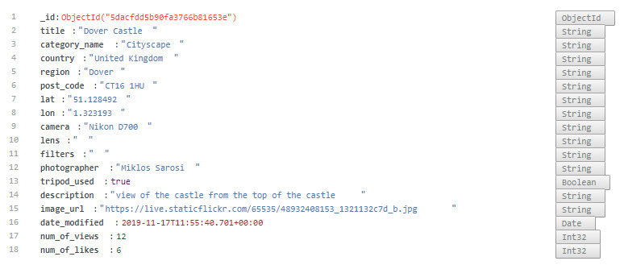

# Photography Locations - Data Centric Milestone Project @ Code Institute

## Project purpose

To build a full-stack site that allows users to manage a common dataset about a particular domain

[Link to the live app on Heroku:](https://photography-locations.herokuapp.com/)

## My aims with the project

- Practice and learn Flask and MongoDb in more detail.
- Set myself a hard deadline and build as much as possible into the project within a short timeframe (focusing mostly on the backend, especially the database handling).
- Despite the tough deadline, 90% score in project evaluation at Code Institute.

This way I kind of model real life situations with tough deadlines and meeting customer expectations. (I aimed the highest possible score and top quality with previous
two milestone projects, but it took relatively long time to complete them, due to the extensive content. That's not realistic. One has to stop adding features, otherwise the 
project's never going to be finished.)

## Value provided:
1.	Users make use of the site to share their own data with the community, and benefit from having convenient access to the data provided by all other members.
2.	The site owner advances their own goals by providing this functionality, potentially by being a regular user themselves. The site owner might also benefit from the 
collection of the dataset as a whole.

## My Project idea - Photography Locations
Create an on-line landscape & cityscape photography location recommendation site. Users can upload their landscape images with location information, to recommend places to 
visit for landscape photographers (hobbyists and pros as well). They can also help the community by providing detailed info about their pictures or useful hints and tips.

### External user’s goal:

#### Find ideas for landscape photo locations
Users seeking for opportunities can search the site for location ideas either near their place or around their upcoming trips. They can also plan their next holiday to visit
places they got inspired about.

#### Get inspiration from pictures they like
High quality pictures can inspire others to try and achieve similar results, either at the same location or a similar they know of.

#### Get hints how to approach photographing a particular site 
Check what equipment others used, what technique they applied. Also they may figure out what the best season or time of the day it is to visit a particular scene.

### Site owner’s goal may include:
#### Build an extensive location database 
A go-to place for landscape photographers. Once reached a critical mess, advertisement income may be generated.

#### Promote their web shop of photo equipment and accessories or their services offered
The owner may run a shop where they are selling photo equipments (camera, lens, etc... ) or accessories (filters, tripods, cleaning sets, etc...). They may build a webshop 
integrated around the database, offering relevant products to users.

Should they have a business around offering photography services, they can advertise themselves, e.g. offering landscape photo courses.

# UX

## Strategy

Present a visually appealing site with landscape and city images, inspiring and helping photographers to find outstanding (potentially not widely-known) locations.

Users should be able to browse images and locations conveniently.

## Scope

### Which features to include in the design? What's on the table for now?

On top of the obvious CRUD operations, must have elements are:
- Map view with all geo-coordinates displayed from database. (Advanced feature but this is the single best option to display locations)
- Overview page with postcard type display of (selected) database records (with limited information to save real estate)
- Let the viewer focus on a single image in the postcard view when they move the mouse over an image by blurring all other pictures.
- Detailed view with larger image and full info from database

### What's out of scope?

According to the project brief: No authentication is expected for this project. The focus is on the data, rather than any business logic.
In a real-life situation the obvious first step would be to authenticate users to avoid modifying and deleting each other's entries. 
In order to keep focus on passing data to and from the frontend as well as 'organising' data on the backend and writing to, retrieving from 
and deleting from the MongoDB database, I left user authentication out of scope (it is indicated in the navbar with disabled nav items, though).

Marketing the site itself and utilising advertising opportunities within the site is also out of scope, therefore no links to social 
media sites or contacts or T&Cs are incorporated.

Providing upload functionality would be a more convenient and user friendly way of supplying images. In order to avoid storing and 
handling potentially large image files, only URLs to images can be entered to the forms. This is certainly not the best UX, but integration 
with Amazon S3 is in the scope of the next milestone project.

## Structure

### Page structure

#### Home page
To attract users and highlight key features, including a map, displaying all the database entries.

#### Search page for browsing and filtering the images/locations.
Display images with key information and provide filtering and sorting tools for users. This is where they can start exploring from, therefore 
the images/cards should serve as a springboard for the exploration, clicking on them will bring more details.

#### Detailed view
To display all the available information about each database entry.

#### Housekeeping (CRUD):
1. **C**reate new entry
2. **R**ead (Display) entries - the detailed view
3. **U**pdate entries - allows to make changes to existing records
4. **D**elete entries

### Database structure and schema:
MongoDB data on Atlas with the following collections:
1. Details:

 

2.	Categories:
- Landscape
- Cityscape
- Cloudscape
- Seascape

## Skeleton

### Wireframe sketches:

#### Search Page:	


#### Details View:	


## Surface

For the home page, I wanted to use a strong background image and big bold letters to draw attention, then the map under the headlines, clearly separated.
Recently, there are quite some websites using the technique of something scrolling over the fixed background, which I like. This gave me the idea of placing the map 
like that.

For the search page and the detailed view, the focus is on the images, therefore I didn't want to distract with a 'busy' background and left it as simple as possible.

## User stories

Taking the Scope into consideration, the following user stories are to be satisfied:

1. As a frequent traveller, I'd like to find nice sceneries to photograph around the places I visit. E.g. 'I have a weekend trip to Lisbon next month, what are the most 	
beautiful sites to visit?	
2. As a hobby photographer, I'd like to improve the quality of my landscape images. There are so many beautiful pictures on the web, but how are those taken? Were there any special filters used? 	
What is the key to taking outstanding images?	
3. As a passionate and experienced photographer, I'd like to help others to improve their technique by showcasing my best images and explaining the process behind.	
4. As the site owner, I'd like to build a platform, where people can share their images, get votes from the community and be proud of their work.	
5. As an advanced hobbyist, I'd like to see whether people like my latest landscape images.	

# Design

## The final design of the key pages:	
### Desktop size
#### Index page and the link to Details page:

#### Search page
	
#### Details page
	
### Mobile layout	
	
### Tablet layout	
...	
	
### Confirming deletion:	
Since there is no authentication on the site, anyone could potentially delete from the database. In order to avoid 'unauthorised' or accidental deleting,
a confirmation modal pops up if someone wanted to delete a record from the database. It includes a hard coded password as well. 	
_Note for the assessor: When testing the delete functionality, insert a test record first and delete that record for testing purposes, please. :)_

_Although it's easy to figure out from the script what the password for deleting is, but - for your convenience - it is: **'Delete'**_


# Features
## Map integration
Google map is inserted on the index page. Markers are placed on the map showing each location in the database. In order to avoid the map becoming overcrowded with markers, 
marker clusters are used to group markers in close proximity. 
When a user moves the mouse over a marker, the key features of that location are displayed in an infoWindow.
Clicking on the marker directs the user to the detailed info of that location displayed on a single page, including the image that was taken at that location.

## Filtering
Users can filter entries by:
- country
- image category
- photographer

Corresponding dropdown boxes are placed on top of the search page, where any combination of filtering can be set and by clicking on the 'Lets Gooo' button filtering is launched.
Results are shown on the same page, sorted by 'popularity' (number of likes).

# Technologies used

[*HTML*](https://en.wikipedia.org/wiki/HTML5), 

[*CSS*](https://en.wikipedia.org/wiki/Cascading_Style_Sheets), 

[Bootstrap](https://getbootstrap.com/docs/4.0/getting-started/introduction/) framework, more specifically 
[**Bootswatch Cyborg theme**](https://bootswatch.com/cyborg/).   

[*JavaScript*](https://www.javascript.com/), I also used [*jQuery*](https://jquery.com/) library to simplify DOM manipulation.

I chose MongoDB as my database, it is a versatile document based database - non-relational or NoSQL. It is useful to store large (hu**_mongo_**us) amount of 
unstructured data. I used [*MongoDB Atlas*](https://www.mongodb.com/cloud/atlas) which is the official MongoDB database-as-a-service available on AWS.

# Testing

## Test planning

During testing, I wanted to test:

- design and responsiveness: to see if I like the look and feel of pages on different devices and screen sizes,
- functioning and operability in different browsers (mobile and pc),
- against user stories,
- against misbehaviour (defensive design).

## Design and responsiveness
During the development process I focused on functionality, although I included Bootstrap grid in the html, I haven't checked if everything looked okay on all sizes.
After finishing the functionality, I started with the index page. Repositioned elements, fixed margins and paddings. There was still one issue, the pictures caused the 
mobile view scaled unexpectedly, which was caused by a _'min-width of 100vw'_ and unnecessary font sizes for ```<h*>``` tags.

When I prepared the details view, I just quickly followed the wireframe I had created at the very beginning, but I didn't really like the look and feel. 
I redesigned it after finished with the functionality.

Image and container sizes needed to be reset to achieve the desired look especially on smaller screen sizes.

## Functioning and operability

### Database, Flask, python

As the aim of the project is to learn about MongoDB, Flask and database manipulation as such, I was experimenting on uncharted lands of adventure.

There were a few interesting learnings:

- Date and time is not as obvious as it first seems. Time zones as well as all kinds of date and time formats make life more difficult when working with date and time. 
The general, most important finding is that we should always store date and time in UTC. And always send an ISO date string or timestamp to backend.

- I added the number of views and number of likes fields to the database after already creating some entries. It meant that some old records showed up without these fields, 
therefore I created a function, which looped through the database and added these fields if they weren't there. I deleted this function after fixing this issue.
- During the development process sometimes I realised I wanted something more/different or things worked differently than I expected. This resulted in necessary workarounds with 
tripod used and format of lat lon, for example. The issue with the tripod used field was that the Bootsrtap switch field isn't creating a Boolean output, but 
sends "on" if switched on and sends nothing if not switched on. I had to handle it in on the backend. I haven't set properly the schema and didn't always use validation 
for the lat lon fields, therefore the database contains different data types for these fields. I created a workaround on the backend, commented all the reasons in the code. 

- It was interesting to see that the number of views also increased when I clicked on the like button, as it is redirects to the same page. I offset this increased number of 
views in the corresponding Flask function.

- The biggest learning here is that the data structure and schema has to be designed well and created properly before anything else.
- There was an interesting bug at with the filters. Filtering worked fine at the first glance, but testing it thoroughly, it turned out that country names and photographer 
names including a space character returned empty search. It turned out the value attribute of the ```<option>``` tag didn't have to be set. 

### JavaScript

There are practically three features that require javaScript:
- the Google Map API, 
- the blurring effect on the search page, and
- checking the password on the modal that prevents accidental deleting from the database 

I heavily tested all of them and used javasScript debugger and console.log-s until they worked the intended way.

I analysed and validated the scripts with JSHints.

There was an interesting issue with the Google Map API's built-in infoWindow. I managed to set the map properly with the exception of the InfoWindow. 
My issue was that if I simply set the infowindow content to a string, it did work, but I wanted to display data passed from my MongoDB through Flask.
I was iterating through the data with a for loop, then assigning the data to various variables, then instantiating the infoWindow and the Marker.
Markers worked fine, also the infoWindow worked fine as long as I assigned a string to it. But I wanted to assign the 'title' and 'category_name' fields from my collection.
Assigning the corresponding variables also worked within the loop (I logged it to the console from the loop, printed just fine), but after the loop finished, 
the map actually showed the same infoWindow for each marker. To overcome it, I had to create an array of infoWindowContent and assign it to the markers one by one.

### Testing in different browsers

**Chrome**
I used Chrome throughout the development, so everything was tested in Chrome first. I frequently checked things on my Android phone with Chrome.

**Safari**
I asked family members to check the page on Apple devices, it worked well on iPhone 4S, SE and 6.

**Firefox and Microsoft Edge**
After autoprefixing my CSS, I checked functionality and appearance in Firefox and Edge, no issues found.

## Testing against the user stories
1. The 'frequent traveller', can find nice sceneries to photograph either browsing the map or filtering the database and check out photos of those. 	
2. The hobby photographer can learn and improve the quality of their landscape images by checking the equipment used for images in the database as well as from description. 
3. The experienced photographer can showcase their best images and provide explanation in the description field for others.	
4. The site owner achieved their goal of building a platform, where people can share their images, get votes from the community, be proud of their work.	
5. The advanced hobbyist can get feedback through the number of likes of their landscape images.

## Defensive testing

### Insufficient information provided. 
To avoid inserting records into the database with insufficient information I set the most important fields as _required_ on the form. This way they cannot be left blank. However, 
insufficient or irrelevant information still can be inserted.

### Image missing
Attaching an image is by providing a URL. The form checks whether URL is inserted, but cannot check if it is a valid URL and whether it is an image or not.

I tested what happens if a user enters a URL that is not an image, but a website. Obviously no images will be displayed then on the search page or in the details, but 
right-clicking on the broken image icon and opening it on a new tab will load that page... As this is the result of using urls for images instead of file upload, which is 
also not the proper UX, fixing the UX would fix this issue as well. (But file upload is out of the scope for this project)

### Image sizes
I linked a relatively large panoramic image (6000 pixels wide, 3MB), it displayed properly on all screen sizes and I haven't noticed significant delays, but surely with excessive 
file size misbehaving users can cause disruption to the site. File upload with restrictions would eliminate this bug as well.

### Number of database entries
As the database is growing, the number of images displayed on the search page is growing and soon it will create problems especially if someone is opening the page on mobile phone
with mobile data. The best solution would be to include pagination, but for time constraints, I simply limited the number of records to be displayed.

# Deployment

I deployed the project to Heroku following the below process:

Created a new app in Heroku, named photography-locations. (The name has to be unique, has to start with a lowercase character, may 
contain only lowercase characters, numbers and dashes)

Installed Heroku in AWS Cloud9:
```
nvm i v8
npm install –g heroku
heroku login –i
```

```heroku git:remote -a photography-locations```

After initialising and making the initial commit:

```git push heroku master```

In order to have it working, **requirements.txt** and **Procfile** are needed.

So, I created the requirements.txt:

```sudo pip3 freeze –local > requirements.txt```

Added to git and committed it:

```
git add requirements.txt
git commit –m “requirements.txt added” 
```

Similarly, I created the Procfile (it is an instruction to Heroku, as to which file is used as our entry at our application – which file we
use to call the app {convention is to name it either run.py or app.py – I chose app.py})

```echo web: python app.py > Procfile```

In order to avoid committing .c9/ folder and its contents, I added them to the .gitignore file and committed the .gitignore file to Git.

I connected my Heroku to my GitHub repo and applied automatic deploy to the master branch.  

## Differences between the deployed production version and the development version
**In production, we should never commit secure keys, API keys, usernames and passwords.**

#### I moved the Atlas MongoDB connection string to the .bashrc file: 

```export MONGO_URI = " ...the connections string here... " ```

and used it in the app:

```app.config["MONGO_URI"] = os.getenv("MONGO_URI")```

#### I also set MONGO_URI in Heroku config vars.

#### I left the Google Map API secure key in the production version, as it is not so easy to replace with and pass to the frontend.
To avoid abuse of the Google Map API key, I restricted it through Google Cloud Platform and is valid only to:
- the website on my Amazon AWS Cloud9 and
- the production site on Heroku. 

#### When finished with the last bug fix and all the finetuning, I set the _Debug_ mode to **False** in the ```app.run()```

# Credits
I used CSS prefixer at https://autoprefixer.github.io/ to ensure cross browser functionality. Also validated the CSS with https://jigsaw.w3.org/css-validator/validator.
The scripts embedded in the html docs as well as the script.js file were analysed and validated with https://jshint.com/

## Content
All texts are written by me.

## Media
Images are either my own or of family and friends (names, nicknames of photographers indicated in the database), uploaded by them.

## Acknowledgements

Thanks to Ali Ashik - my mentor - for not only the development ideas and support but orienting me in time management and what to include and what to leave out of scope.

Tutor support helped me with debugging, not only finding certain bugs, but improving my thinking process when searching for bugs. Tim was exceptionally awesome!